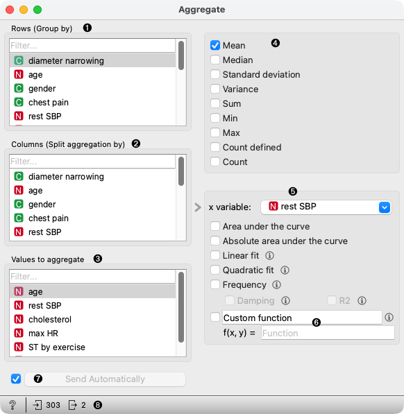
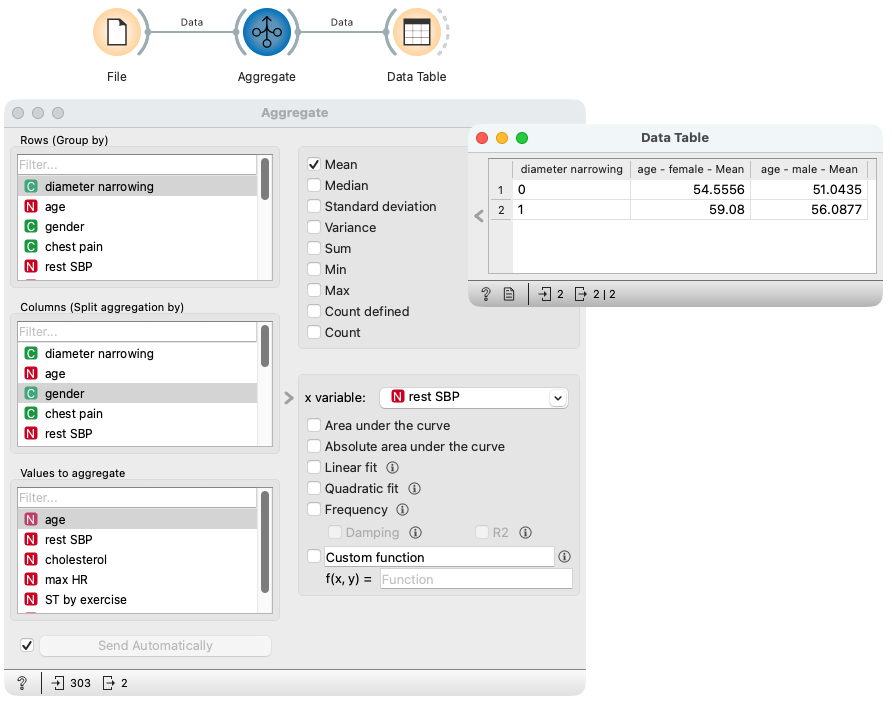

Aggregate
=========

Organize data into groups based on selected attributes and aggregate values in the 
group with selected aggregation functions.

**Inputs**

- Data: Data to be aggregated

**Outputs**

- Output: Aggregated data

The widget organizes data into groups defined by values of attributes selected in 
the `Rows` list. For each group, the widget computes selected aggregations of 
attributes selected in the `Values` list. 

1. Select attributes whose values define groups -- rows of the output (aggregated) table.
2. Optionally select attributes that produce multiple sets of aggregated columns. 
   The resulting table will contain a column for each value of a selected attribute 
   for each aggregation.
3. Select the attributes to aggregate. The resulting table will contain 
   all selected aggregations for each of the selected attributes in the `Values` list. 
4. Select which aggregations to apply within the groups.
5. Select advanced aggregations which are applied on selected values for each group. 
   Advanced aggregations also need the attribute used as sample points for an aggregation 
   (x-axis values on the graph). Select it with `x variable` control.
6. If needed, input your aggregation that gets `x` values (values of the variable 
   selected in the `x variable` field) and `y` (values of the variable selected in 
   the `Values` list). Set function name by replacing the default *Custom function* name.
7. Control whether aggregations are getting computed and outputted right after the 
   change is made in widget settings or Apply changes manually.
8. Get help, observe the input and the output data size.

Example
-------

In the following example, we first load heart disease data with the File widget.
In the Aggregate widget, we define groups with values of the `diameter narrowing` attribute
with selection in the `Rows` list. We set that to have a separate aggregation column
for each value in the `gender` attribute in the `Columns` list and to aggregate
values of the `age` attribute in the `Values` list. We selected that we want
to compute `mean` aggregation.

With the `Data Table` widget, we can observe the widget's output. We can see that
the resulting table has one row for each value in `diameter narrowing`. Columns are all combinations
of selected aggregations and selected values of the `Columns` attribute -- `gender`.
Values of the table are `means` (averages) for selected
`Values` -- age.

Notes
-----

The **Frequency** aggregation uses the polynomial function of degree 2 
(Quadratic function) for de-trending the signal. You can use the 
**Custom function** field for frequency aggregation if you need any other 
de-trending degree. For example:
- to de-trend with linear function use: `frequency(x, y, detrend_degree=1)`
- to de-trend with constant function (subtracting the signal mean), use:
  `frequency(x, y, detrend_degree=0)`
- to turn off de-trending use: `frequency(x, y, detrend_degree=None)`

For Damping and R2, set the `use_damping` and `compute_r2` keyword parameters. 
For example: `frequency(x, y, detrend_degree=None, use_damping=True, compute_r2=True)`
