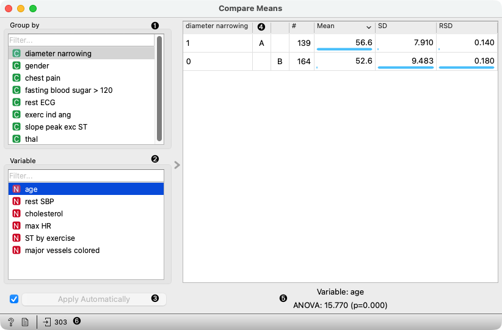

Compare Means
=============

Pairwise comparison of means using Tukey's test.

**Inputs**

- Data: input dataset

The **Compare Means** widget tests for equality of means of a selected numeric variable for each pair of groups defined by the *Group by* variable.
The results of Tukey's test are presented with a connecting letter report. The sets of letters connect all groups which do not have statistically significant differences in means.

1. Select a categorical variable to use for grouping the data.
2. Select a numeric variable for which the group means should be compared.
3. If **Apply Automatically** is ticked, the letter report is calculated automatically on any change. Alternatively, click **Apply**.
4. Table with group labels, letters, counts of instances in groups, means, standard deviations and relative standard deviations.
5. Variable name and computed F statistic of the ANOVA test with associated p-value from the F distribution.
6. Get help, make the report, or observe the size of the input data.
