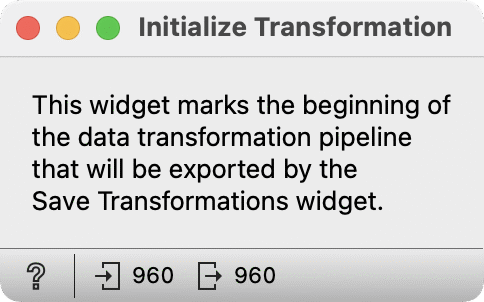

Initialize Transformation
=========================

Define the starting point of the transformations in the workflow.

**Inputs**

- Data: Input dataset

**Outputs**

- Data: Output dataset

The **Initialize Transformation** widget defines the starting point of the 
transformations in the workflow. 
[The Save Transformations widget](save-transformations.md) exports only 
transformations following this widget, skipping all potential transformations 
before the Initialize Transformation widget.

Example
-------

This example demonstrates the transformations export. We first load the iris dataset. The Initialize
Transformation widget defines the start of the exported transformation workflow. 

In the workflow we insert a few transformations such as
Aggregate, which averages sepal width for each value of sepal length;
Series Slicer, which slices data into three slices; and
Select Columns which defines the target variable for the model.

The Save Transformations widget exports the mentioned transformation pipeline to a 
pickle file. We also train the linear regression model and export it.

