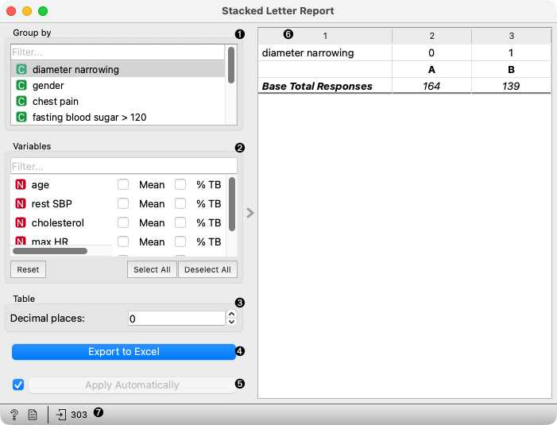

Stacked Letter Report
=====================

Tukey's test based letter report.

**Inputs**

- Data: input dataset

The **Stacked Letter Report** performs a Tukey's test for selected numeric variables (default: first 20) in the dataset.
The data are divided into groups according to selected *Group by* variable.

1. Select a categorical variable to use for grouping the data. Multiple variables can be selected.
2. Compute Mean and/or % TB (top box, i.e. highest value).
3. Set number of decimal places for the table data.
4. **Export to Excel** saves the table content to an Excel spreadsheet. Horizontal lines can be added to the table by right-clicking upon the table area and selecting *Add horizontal line*. The line can be removed by selecting *Remove horizontal line*.
5. If **Apply Automatically** is ticked, the table is updated automatically on any change. Alternatively, click **Apply**.
6. Table with group labels, letters, counts of instances in groups, means and/or % TB.
7. Get help, make the report, or observe the size of the input data.
