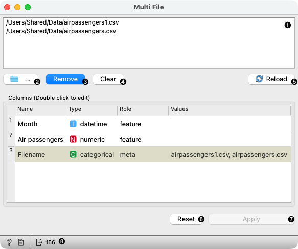

Multi File
==========

Read data from input files and send a data table to the output.

**Outputs**

- Data: A dataset of concatenated files

The **Multifile** widget loads data from different files, concatenates them and sends the concatenated dataset to the output. The widget outputs a union of columns from all files.

1. Display a list of selected files.
2. Browse through folders on the computer and select multiple files to load. In 
   the file dialog, you can select all files in the folder with Ctrl/Cmd+A or 
   select a range of files by selecting the first file and holding shift while 
   selecting the last one. To select multiple non-consecutive files, hold Ctrl/Cmd.
3. Remove selected files from the list of files.
4. Clear the list of files.
5. Reload data in case if they have changed after the previous browse.
6. Set *Columns* table to default values.
7. Feature types are automatically set after the files are loaded. One can 
   manually set those in the **Columns** table. After editing, click 
   **Apply** to apply the changes.
8. Show help, produce a report, observe the number of rows in the data. Click on the text to get a more detailed description of the loaded data.
