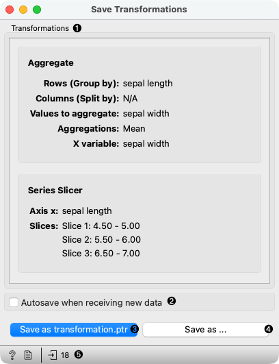
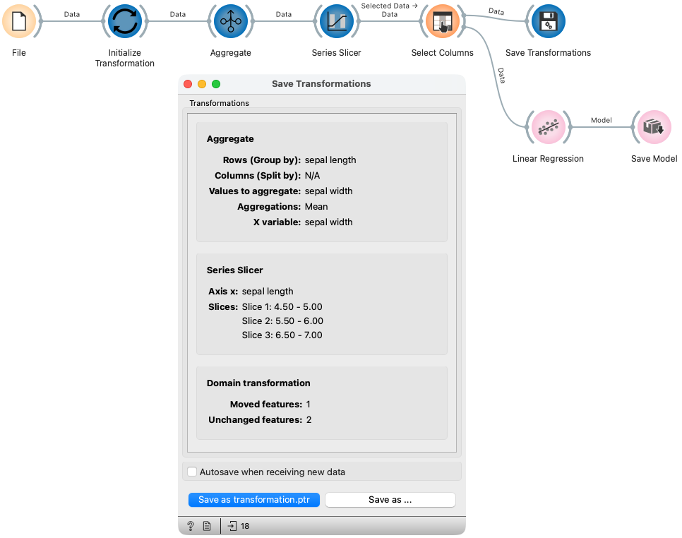

Save Transformations
====================

Save transformations from the workflow to a file.

**Inputs**

- Data: Input dataset expected to include transformations

The **Save Transformations** widget saves transformations from the workflow 
starting at the [Initialize Transformation](initialize-transformation.md) widget to a 
pickle file that can be used in code (for example, within a Streamlit application).



1. The transformations overview enables the users to inspect transformations that the widget exports.
2. Select whether transformations are saved every time new data appear at the input.
3. Save transformations to a file manually. 
4. Save transformations to a different file than the currently selected.
5. Get help, compose a report, or observe the input and output data sizes.

Example of saving transformations
---------------------------------

This example demonstrates the transformations export. We first load the iris dataset.
The Initialize Transformation widget defines the start of 
the exported transformation workflow. 

In the workflow we insert a few transformations such as
Aggregate, which averages sepal width for each value of sepal length;
Series Slicer, which slices data into three slices; and
Select Columns which defines the target variable for the model.

The Save Transformations widget shows the list of transformations to ensure 
all workflow transformations are supported and correctly defined.
It exports all mentioned transactions to the `transformation.ptr` pickle file. 
We also train and export the linear regression model with the Save Model widget.




Example of using saved transformations
--------------------------------------

This example demonstrates how to use transformations saved with 
the Save Transformations widget. First, we load data from a file.
Then we load transformations from the pickle file where 
`path-to-transformations.ptr` is a path to the file saved by 
the Save Transformations widget. We apply transformations to 
the data using `transformations.from_pandas` on the data. 
The result is an Orange Table instance.

After applying transformations, we can also load the model saved by 
the Save Model widget and apply it to the transformed data.

```python
import pickle

import pandas as pd

df = pd.read_csv("path to data")

with open("path-to-transformations.ptr", "rb") as f:
    transformation = pickle.load(f)
result = transformation.from_pandas(df)

with open("path-to-model.pkcls", "rb") as f:
    model = pickle.load(f)
predictions = model(result)
```


