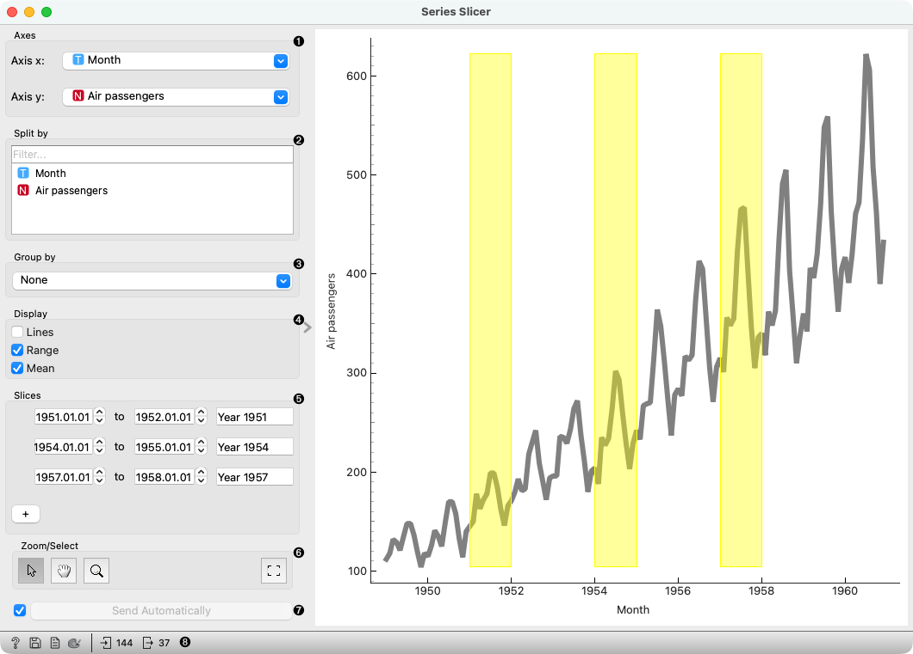

Series Slicer
=============

Visualization and selection of time series data.

**Inputs**

- Data: input dataset

**Outputs**

- Selected Data: instances selected from the plot

The **Series Slicer** widget displays the data as a series of points connected 
by straight line segments. It only works for numerical data, while categorical 
can be used to split and group the data points.

1. Select the x and y feature.
2. Select features to use for splitting the time series data.
3. Select a categorical feature to use for grouping the data. Use None to show ungrouped data.
4. Select what you wish to display:
   - Lines show individual time series in a plot.
   - Range highlights the area between the minimum and maximum values.
   - Mean adds the line for mean value. If Group by is selected will display means 
     per each group value.
5. Select series slices.
6. *Select, pan, zoom, and zoom to fit* are the options for exploring the graph.
7. If **Send Automatically** is ticked, the output is sent automatically after any change.
   Alternatively, click **Send**.
8. Get help, save the plot, make the report, set plot properties, or observe the size of input and output data.
