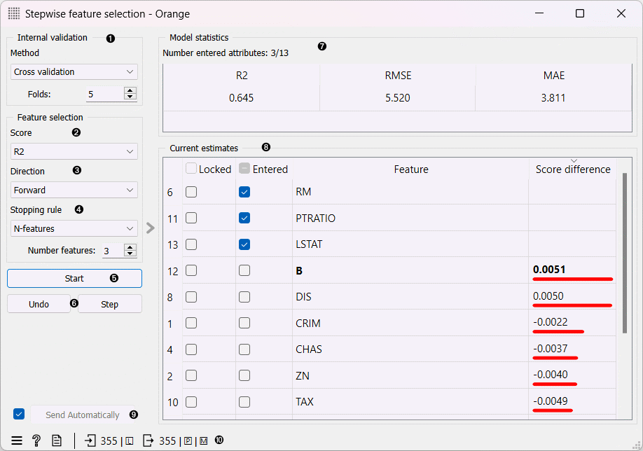
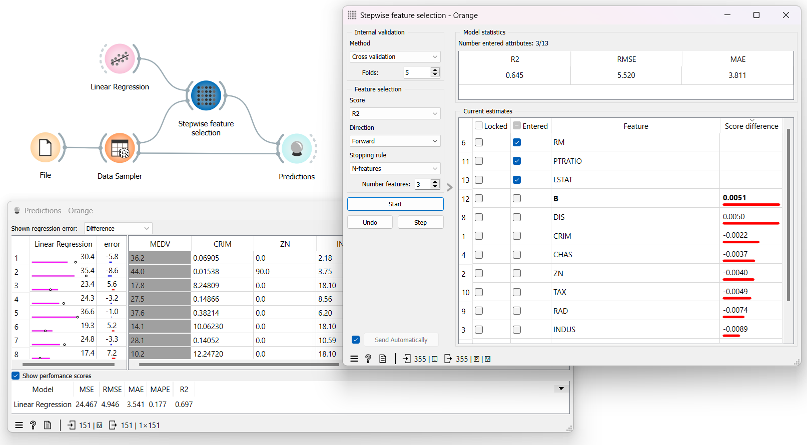
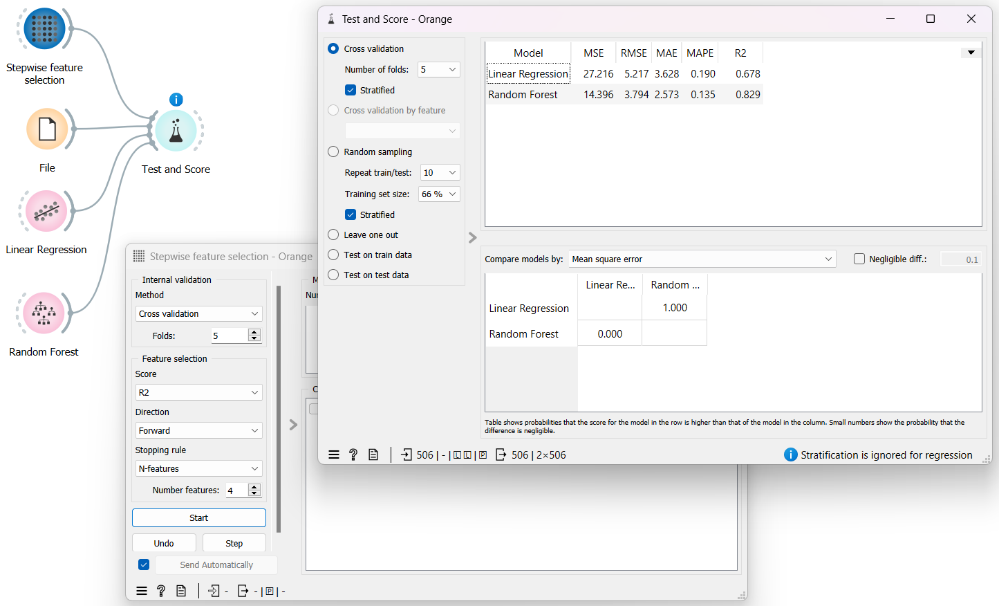

Stepwise Feature Selection
==========================

Select relevant features with stepwise feature selection.

**Inputs**

- Data: Data used for feature selection
- Learner: Learner used for computing scores and score differences

**Outputs**

- Data: Input data with only selected features
- Preprocessor: Stepwise feature selection preprocessor.
- Model: Model built on selected features and input learner. 

The widget performs stepwise feature selection among features in the input data. Features are scored by their contribution to the model score. Contribution is computed as a difference between the score of the current model and the model with the feature included in the model or removed from it (depending on direction). Each step adds or removes the feature with the highest score difference.

For training models, the widget uses the learner from the input. If the input learner is missing, the widget uses linear regression for data with a numeric target or logistic regression when the target is categorical.

The widget also outputs a preprocessor, which uses all settings from the control area on the left and can be used as an input to other widgets that accept preprocessors (e.g. Test and Score). The preprocessor runs feature selection until it satisfies the stopping rule.

1. Select the method to evaluate models. It is used to compute model statistics and feature scores. The widget performs model training and evaluation for each feature that can be included or removed, which is time-consuming. To overcome this issue, we suggest using the random split for data with many instances and cross-validation for data with fewer instances.
2. Select the score used to compute the score difference.
3. Select the direction of feature selection. When the direction is **forward**, the feature with the best score difference is added to the model in each step, while when **backward**, features with the best score differences are removed from the model. 
4. The rule to stop adding/removing (depending on direction) features when multistep feature selection is utilized via the Start button or in the preprocessor.
   - **N-features**: features are added/removed while the number of entered features is lower/greater than the specified `Number features`.
   - **Score delta**: features are added/removed while a step improves the model score for at least the threshold set in the `Threshold` field.
   - **Minimum AICc**: features are added/removed until [Akaike information criterion measure](https://en.wikipedia.org/wiki/Akaike_information_criterion#AICc) decreases.
   - **Minimum BIC**: Features are added/removed until [Baesian information criterion measure](https://en.wikipedia.org/wiki/Bayesian_information_criterion) decreases.
5. Start a multistep feature selection that adds/removes features until the stopping rule is met or a user presses the stop button.  
6. Perform a single step that adds/removes a single feature or undo the last step.
7. Observe the performance of the model on currently entered features. If no features are entered, the widget uses the constant model.
8. See and interact with features. 
   - **Lock** column: (Un)Lock features from being inserted or removed from the model. 
   - **Entered** column:  Manually enter/remove features.
   - **Feature** column: Feature name
   - **Score difference** column: The difference between the current and model with a specific feature added. When the direction is forward, scores show model improvements if we add a feature; when backwards, the difference indicates the model improvement with each feature removed. 
9. Control whether the data and model outputs are sent automatically after each step or apply changes manually.
10. Get help, compose a report, or observe the input and output data sizes.

Example
---------

In the following example, we split the Housing dataset into two parts with the **Data Sampler** widget. We use randomly selected 70% of instances for the stepwise feature selection.

In the **Stepwise Feature Selection** widget, we perform three feature selection steps with the settings in the example. The process selects features RM, PTRATIO and LSTAT, which improve the R2 score of the input Linear Regression model the most. According to cross-validation on the input data, the R2 score of the Linear Regression model is 0.645, RMSE is 5.520, and MAE is 3.811.

One of the outputs is a Linear Regression model trained on all rows of the input data, but using only the selected features. We use the output model to make predictions for data instances not selected by the Data Sampler widget (the Remaining Data output) with the **Predictions** widget.

In a real-world scenario, feature selection would be performed on one dataset, and the resulting model would be applied to a different dataset.

Another example shows the use of the widget as a preprocessor. In this case, the widget doesn't need any data on the input, but it can accept a learner. In the **Stepwise Feature Selection** widget, we set internal validation settings and feature selection settings that the preprocessor will use. 

The **Test and Score** widget applies the preprocessor in every cross-validation step. In our case, the preprocessor performs steps until four features are selected.

